<!--
  ██████╗ ██╗      █████╗  ██████╗██╗  ██╗    ██╗  ██╗ ██████╗ ██╗     ███████╗
  ██╔══██╗██║     ██╔══██╗██╔════╝██║ ██╔╝    ██║  ██║██╔═══██╗██║     ██╔════╝
  ██████╔╝██║     ███████║██║     █████╔╝     ███████║██║   ██║██║     █████╗
  ██╔══██╗██║     ██╔══██║██║     ██╔═██╗     ██╔══██║██║   ██║██║     ██╔══╝
  ██████╔╝███████╗██║  ██║╚██████╗██║  ██╗    ██║  ██║╚██████╔╝███████╗███████╗
  ╚═════╝ ╚══════╝╚═╝  ╚═╝ ╚═════╝╚═╝  ╚═╝    ╚═╝  ╚═╝ ╚═════╝ ╚══════╝╚══════╝
  MATRIX
  Theme: 3D Portfolio  |  Colors: #0a0e17 / #5eead4 / #eae5ec  |  Font: Geist
-->

<!-- ════════════════════ TOP WAVE ════════════════════ -->


<!-- ════════════════════ AMBIENT CIRCLES (from 3D portfolio landing.css) ════════════════════ -->
<p align="left">
  
  
</p>

<!-- ════════════════════ HERO — exact Landing.tsx layout ════════════════════ -->

<table width="100%" border="0" cellspacing="0" cellpadding="0">
<tr>
<td width="38%" valign="middle">

<!-- landing-intro left side -->
<sub>Hello! I'm</sub>

# YAEESH<br/><span>BABAR</span>

<!-- Typing roles (exact rotating text from initialFX.ts) -->


</td>
<td width="24%" valign="middle" align="center">

<!-- ════ ANIMATED ROBOT — eyes follow cursor simulation ════ -->


</td>
<td width="38%" valign="middle" align="right">

<!-- landing-info right side (exact from Landing.tsx) -->
<sub>Founder &</sub>

### MERN Stack
### <span style="color:#5eead4">Developer</span>

[](https://wa.me/923100786960)

📍 Lahore, Pakistan 🇵🇰

</td>
</tr>
</table>

<!-- Nav badges (exact from SocialIcons.tsx) -->
<div align="center">

[](https://yaeeshbabar.com)&nbsp;[](https://www.linkedin.com/in/yaeesh-babar-516bab28a/)&nbsp;[](https://www.upwork.com/freelancers/~0175e100f3b0b85788)&nbsp;[](https://www.fiverr.com/)&nbsp;[](mailto:yaeeshbabar@gmail.com)&nbsp;[](https://www.instagram.com/yaeeshbabar/)

</div>

---

<!-- ════════════════════ ABOUT — About.tsx style ════════════════════ -->

> ### About Me
>
> I'm a **Full Stack MERN Developer** and the **Founder of Black Hole Matrix** — a software agency based in Lahore, Pakistan. I build scalable web apps, SaaS platforms, AI tools, mobile apps, Shopify stores and WordPress sites for clients worldwide.
>
> Started with internships at **NetSol Technologies** & **Speridian Technologies** → trained at **Knowledge Streams** → led a software agency. Today I ship production-grade software for global clients on **Upwork** and **Fiverr**.

---

<!-- ════════════════════ WHAT I DO — exact WhatIDo.tsx with SVG dashed borders ════════════════════ -->

<div align="center">

## W*HAT*&nbsp;&nbsp;&nbsp;I&nbsp; <span>**DO**</span>

</div>

<!-- SVG dashed border boxes — exact replica of what-border1, what-border2, what-content CSS -->
<div align="center">
<svg width="720" height="320" viewBox="0 0 720 320" xmlns="http://www.w3.org/2000/svg">
  <defs>
    <filter id="glow2"><feGaussianBlur stdDeviation="3" result="b"/><feMerge><feMergeNode in="b"/><feMergeNode in="SourceGraphic"/></feMerge></filter>
  </defs>
  <!-- Outer vertical dashes (what-border2) -->
  <line x1="10" y1="10" x2="10" y2="310" stroke="white" stroke-width="1.5" stroke-dasharray="7,7" stroke-opacity="0.2"/>
  <line x1="710" y1="10" x2="710" y2="310" stroke="white" stroke-width="1.5" stroke-dasharray="7,7" stroke-opacity="0.2"/>

  <!-- BOX 1 — WEB & SAAS -->
  <!-- what-border1: horizontal dashes top and bottom -->
  <line x1="20" y1="20" x2="340" y2="20" stroke="white" stroke-width="1.5" stroke-dasharray="6,6" stroke-opacity="0.25"/>
  <line x1="20" y1="155" x2="340" y2="155" stroke="white" stroke-width="1.5" stroke-dasharray="6,6" stroke-opacity="0.25"/>
  <!-- what-corner brackets -->
  <path d="M20,20 L20,32 M20,20 L32,20" stroke="white" stroke-width="3" stroke-opacity="0.8" fill="none"/>
  <path d="M340,20 L340,32 M340,20 L328,20" stroke="white" stroke-width="3" stroke-opacity="0.8" fill="none"/>
  <path d="M20,155 L20,143 M20,155 L32,155" stroke="white" stroke-width="3" stroke-opacity="0.8" fill="none"/>
  <path d="M340,155 L340,143 M340,155 L328,155" stroke="white" stroke-width="3" stroke-opacity="0.8" fill="none"/>
  <!-- Content -->
  <text x="42" y="50" font-family="Geist,sans-serif" font-size="16" font-weight="600" fill="#eae5ec" letter-spacing="1">WEB &amp; SAAS</text>
  <text x="42" y="70" font-family="Geist,sans-serif" font-size="10" fill="#5eead4" fill-opacity="0.5" letter-spacing="0.5">Full Stack MERN Development</text>
  <text x="42" y="92" font-family="Geist,sans-serif" font-size="10" fill="#eae5ec" fill-opacity="0.6">Scalable web apps, SaaS platforms,</text>
  <text x="42" y="107" font-family="Geist,sans-serif" font-size="10" fill="#eae5ec" fill-opacity="0.6">dashboards &amp; admin panels.</text>
  <text x="42" y="127" font-family="Geist,sans-serif" font-size="9" fill="#eae5ec" fill-opacity="0.35" letter-spacing="1">SKILLSET &amp; TOOLS</text>
  <rect x="42" y="136" width="52" height="14" rx="7" fill="none" stroke="white" stroke-opacity="0.25" stroke-width="1"/>
  <text x="50" y="147" font-family="Geist,sans-serif" font-size="9" fill="white" fill-opacity="0.7">React.js</text>
  <rect x="100" y="136" width="50" height="14" rx="7" fill="none" stroke="white" stroke-opacity="0.25" stroke-width="1"/>
  <text x="108" y="147" font-family="Geist,sans-serif" font-size="9" fill="white" fill-opacity="0.7">Node.js</text>
  <rect x="156" y="136" width="58" height="14" rx="7" fill="none" stroke="white" stroke-opacity="0.25" stroke-width="1"/>
  <text x="164" y="147" font-family="Geist,sans-serif" font-size="9" fill="white" fill-opacity="0.7">MongoDB</text>
  <rect x="220" y="136" width="48" height="14" rx="7" fill="none" stroke="white" stroke-opacity="0.25" stroke-width="1"/>
  <text x="228" y="147" font-family="Geist,sans-serif" font-size="9" fill="white" fill-opacity="0.7">Stripe</text>
  <!-- Arrow box -->
  <rect x="310" y="128" width="18" height="18" fill="none" stroke="white" stroke-opacity="0.4" stroke-width="1"/>
  <path d="M314,140 L319,134 M319,134 L324,140 M319,134 L319,142" stroke="white" stroke-width="1" stroke-opacity="0.6" fill="none"/>

  <!-- BOX 2 — AI & AUTOMATION -->
  <line x1="20" y1="165" x2="340" y2="165" stroke="white" stroke-width="1.5" stroke-dasharray="6,6" stroke-opacity="0.25"/>
  <line x1="20" y1="305" x2="340" y2="305" stroke="white" stroke-width="1.5" stroke-dasharray="6,6" stroke-opacity="0.25"/>
  <path d="M20,165 L20,177 M20,165 L32,165" stroke="white" stroke-width="3" stroke-opacity="0.8" fill="none"/>
  <path d="M340,165 L340,177 M340,165 L328,165" stroke="white" stroke-width="3" stroke-opacity="0.8" fill="none"/>
  <path d="M20,305 L20,293 M20,305 L32,305" stroke="white" stroke-width="3" stroke-opacity="0.8" fill="none"/>
  <path d="M340,305 L340,293 M340,305 L328,305" stroke="white" stroke-width="3" stroke-opacity="0.8" fill="none"/>
  <text x="42" y="195" font-family="Geist,sans-serif" font-size="16" font-weight="600" fill="#eae5ec" letter-spacing="1">AI &amp; AUTOMATION</text>
  <text x="42" y="215" font-family="Geist,sans-serif" font-size="10" fill="#5eead4" fill-opacity="0.5" letter-spacing="0.5">AI Tools &amp; n8n Workflow Automation</text>
  <text x="42" y="237" font-family="Geist,sans-serif" font-size="10" fill="#eae5ec" fill-opacity="0.6">AI-powered apps, multi-agent systems,</text>
  <text x="42" y="252" font-family="Geist,sans-serif" font-size="10" fill="#eae5ec" fill-opacity="0.6">workflow automation &amp; integrations.</text>
  <text x="42" y="272" font-family="Geist,sans-serif" font-size="9" fill="#eae5ec" fill-opacity="0.35" letter-spacing="1">SKILLSET &amp; TOOLS</text>
  <rect x="42" y="281" width="44" height="14" rx="7" fill="none" stroke="white" stroke-opacity="0.25" stroke-width="1"/>
  <text x="50" y="292" font-family="Geist,sans-serif" font-size="9" fill="white" fill-opacity="0.7">OpenAI</text>
  <rect x="92" y="281" width="30" height="14" rx="7" fill="none" stroke="white" stroke-opacity="0.25" stroke-width="1"/>
  <text x="100" y="292" font-family="Geist,sans-serif" font-size="9" fill="white" fill-opacity="0.7">n8n</text>
  <rect x="128" y="281" width="52" height="14" rx="7" fill="none" stroke="white" stroke-opacity="0.25" stroke-width="1"/>
  <text x="136" y="292" font-family="Geist,sans-serif" font-size="9" fill="white" fill-opacity="0.7">Agents</text>
  <rect x="186" y="281" width="78" height="14" rx="7" fill="none" stroke="white" stroke-opacity="0.25" stroke-width="1"/>
  <text x="194" y="292" font-family="Geist,sans-serif" font-size="9" fill="white" fill-opacity="0.7">Automation</text>
  <rect x="310" y="273" width="18" height="18" fill="none" stroke="white" stroke-opacity="0.4" stroke-width="1"/>
  <path d="M314,285 L319,279 M319,279 L324,285 M319,279 L319,287" stroke="white" stroke-width="1" stroke-opacity="0.6" fill="none"/>

  <!-- BOX 3 — MOBILE & STORES (right column) -->
  <line x1="370" y1="20" x2="700" y2="20" stroke="white" stroke-width="1.5" stroke-dasharray="6,6" stroke-opacity="0.25"/>
  <line x1="370" y1="305" x2="700" y2="305" stroke="white" stroke-width="1.5" stroke-dasharray="6,6" stroke-opacity="0.25"/>
  <path d="M370,20 L370,32 M370,20 L382,20" stroke="white" stroke-width="3" stroke-opacity="0.8" fill="none"/>
  <path d="M700,20 L700,32 M700,20 L688,20" stroke="white" stroke-width="3" stroke-opacity="0.8" fill="none"/>
  <path d="M370,305 L370,293 M370,305 L382,305" stroke="white" stroke-width="3" stroke-opacity="0.8" fill="none"/>
  <path d="M700,305 L700,293 M700,305 L688,305" stroke="white" stroke-width="3" stroke-opacity="0.8" fill="none"/>
  <text x="392" y="55" font-family="Geist,sans-serif" font-size="16" font-weight="600" fill="#eae5ec" letter-spacing="1">MOBILE &amp; STORES</text>
  <text x="392" y="75" font-family="Geist,sans-serif" font-size="10" fill="#5eead4" fill-opacity="0.5" letter-spacing="0.5">Apps, Shopify &amp; WordPress</text>
  <text x="392" y="105" font-family="Geist,sans-serif" font-size="10" fill="#eae5ec" fill-opacity="0.6">Cross-platform mobile apps and</text>
  <text x="392" y="120" font-family="Geist,sans-serif" font-size="10" fill="#eae5ec" fill-opacity="0.6">high-converting storefronts &amp;</text>
  <text x="392" y="135" font-family="Geist,sans-serif" font-size="10" fill="#eae5ec" fill-opacity="0.6">WordPress / WooCommerce sites.</text>
  <text x="392" y="160" font-family="Geist,sans-serif" font-size="9" fill="#eae5ec" fill-opacity="0.35" letter-spacing="1">SKILLSET &amp; TOOLS</text>
  <rect x="392" y="169" width="74" height="14" rx="7" fill="none" stroke="white" stroke-opacity="0.25" stroke-width="1"/>
  <text x="400" y="180" font-family="Geist,sans-serif" font-size="9" fill="white" fill-opacity="0.7">React Native</text>
  <rect x="472" y="169" width="48" height="14" rx="7" fill="none" stroke="white" stroke-opacity="0.25" stroke-width="1"/>
  <text x="480" y="180" font-family="Geist,sans-serif" font-size="9" fill="white" fill-opacity="0.7">Shopify</text>
  <rect x="392" y="188" width="70" height="14" rx="7" fill="none" stroke="white" stroke-opacity="0.25" stroke-width="1"/>
  <text x="400" y="199" font-family="Geist,sans-serif" font-size="9" fill="white" fill-opacity="0.7">WordPress</text>
  <rect x="468" y="188" width="74" height="14" rx="7" fill="none" stroke="white" stroke-opacity="0.25" stroke-width="1"/>
  <text x="476" y="199" font-family="Geist,sans-serif" font-size="9" fill="white" fill-opacity="0.7">WooCommerce</text>
  <rect x="672" y="280" width="18" height="18" fill="none" stroke="white" stroke-opacity="0.4" stroke-width="1"/>
  <path d="M676,292 L681,286 M681,286 L686,292 M681,286 L681,294" stroke="white" stroke-width="1" stroke-opacity="0.6" fill="none"/>
</svg>
</div>

---

<!-- ════════════════════ WORK — exact Work.tsx carousel border style ════════════════════ -->

<div align="center">

## My **Work**

</div>

<!-- carousel top border (exact: border-top: 1px solid #363636) -->


<!-- PROJECT 01 -->
<table width="100%"><tr>
<td width="10%" valign="middle" align="center"><br/><br/>

```
01
```

</td>
<td width="58%" valign="top">

**AgentForge — Multi-Agent AI Programming Simulator**

<sub>`AI · Multi-Agent · Automation`</sub>

Multiple AI agents collaborate to plan, code, review, and debug — simulating a real dev team powered by AI. Built for developers exploring autonomous agent workflows.

<sub>`OpenAI` · `Multi-Agent` · `React` · `Node.js` · `Automation`</sub>

[](https://github.com/yaeeshbabar/AgentForge-Multi-Agent-AI-Programming-Simulator-main)

</td>
<td width="32%" valign="middle" align="center">


</td>
</tr></table>


<!-- PROJECT 02 -->
<table width="100%"><tr>
<td width="10%" valign="middle" align="center"><br/><br/>

```
02
```

</td>
<td width="58%" valign="top">

**Ecommerce Kicks — Full Stack Sneaker Store**

<sub>`E-commerce · MERN · Stripe Payments`</sub>

Full-featured sneaker store with product management, size selection, cart, Stripe payments, order tracking, and complete admin dashboard.

<sub>`React` · `Node.js` · `MongoDB` · `Stripe` · `Tailwind CSS`</sub>

[](https://github.com/yaeeshbabar/ecommerce-kicks-main)

</td>
<td width="32%" valign="middle" align="center">


</td>
</tr></table>


<!-- PROJECT 03 -->
<table width="100%"><tr>
<td width="10%" valign="middle" align="center"><br/><br/>

```
03
```

</td>
<td width="58%" valign="top">

**Ride Booking API — Production Backend**

<sub>`REST API · Real-time · Ride Hailing`</sub>

Scalable backend with real-time ride matching, driver/rider auth, booking management, fare calculation, and trip history — built for production scale.

<sub>`Node.js` · `Express` · `MongoDB` · `JWT` · `Socket.io`</sub>

[](https://github.com/yaeeshbabar/ride-booking-api-main)

</td>
<td width="32%" valign="middle" align="center">


</td>
</tr></table>


<!-- PROJECT 04 -->
<table width="100%"><tr>
<td width="10%" valign="middle" align="center"><br/><br/>

```
04
```

</td>
<td width="58%" valign="top">

**Task Management Application**

<sub>`Kanban · Team Collaboration · Project Management`</sub>

Drag-and-drop Kanban boards with team assignment, priority levels, deadline tracking, real-time updates, and role-based access control.

<sub>`React` · `Node.js` · `MongoDB` · `REST API` · `JWT`</sub>

[](https://github.com/yaeeshbabar/task-management-application-main)

</td>
<td width="32%" valign="middle" align="center">


</td>
</tr></table>


<!-- PROJECT 05 -->
<table width="100%"><tr>
<td width="10%" valign="middle" align="center"><br/><br/>

```
05
```

</td>
<td width="58%" valign="top">

**Awesome n8n Templates — Automation Library**

<sub>`No-Code · Workflow Automation · n8n`</sub>

Production-ready n8n templates for email workflows, CRM integrations, social media automation, data pipelines, webhooks, and AI-powered workflows.

<sub>`n8n` · `Automation` · `Webhooks` · `API Integrations` · `AI`</sub>

[](https://github.com/yaeeshbabar/awesome-n8n-templates-main)

</td>
<td width="32%" valign="middle" align="center">


</td>
</tr></table>


<!-- PROJECT 06 -->
<table width="100%"><tr>
<td width="10%" valign="middle" align="center"><br/><br/>

```
06
```

</td>
<td width="58%" valign="top">

**Kitchen Cuisinia — Food Ordering System**

<sub>`Restaurant Management · Real-time Orders`</sub>

Real-time food ordering with menu management, cart, order tracking, Stripe payments, and admin dashboard for restaurant owners.

<sub>`React` · `Node.js` · `MongoDB` · `Express` · `Stripe`</sub>

[](https://github.com/yaeeshbabar/kitchen-cuisinia) &nbsp; [](https://artisansofficial.com/)

</td>
<td width="32%" valign="middle" align="center">


</td>
</tr></table>


<!-- PROJECT 07 -->
<table width="100%"><tr>
<td width="10%" valign="middle" align="center"><br/><br/>

```
07
```

</td>
<td width="58%" valign="top">

**Streamify — Movie Streaming Platform**

<sub>`Netflix-style · TMDB API · User Auth`</sub>

Movie discovery with TMDB API, watchlists, search, filtering, JWT authentication, and clean Netflix-inspired UI.

<sub>`React` · `Node.js` · `MongoDB` · `TMDB API` · `JWT`</sub>

[](https://github.com/yaeeshbabar/stream-main)

</td>
<td width="32%" valign="middle" align="center">


</td>
</tr></table>


<!-- PROJECT 08 -->
<table width="100%"><tr>
<td width="10%" valign="middle" align="center"><br/><br/>

```
08
```

</td>
<td width="58%" valign="top">

**AI Meal Planner — Custom Crave**

<sub>`OpenAI · Personalized Plans · Health Tech`</sub>

Generates personalized weekly meal plans via OpenAI based on dietary goals, allergies, and preferences. Includes calorie tracking and grocery lists.

<sub>`React` · `Node.js` · `OpenAI API` · `MongoDB` · `Tailwind`</sub>

[](https://github.com/yaeeshbabar/planner-main)

</td>
<td width="32%" valign="middle" align="center">


</td>
</tr></table>


<!-- PROJECT 09 -->
<table width="100%"><tr>
<td width="10%" valign="middle" align="center"><br/><br/>

```
09
```

</td>
<td width="58%" valign="top">

**Billing Solutions — Invoice SaaS**

<sub>`SaaS · PDF Generation · Business Tools`</sub>

Client management, PDF invoice generation, payment tracking, recurring billing, and analytics for freelancers and small businesses.

<sub>`React` · `Node.js` · `MongoDB` · `PDF` · `Express`</sub>

[](https://github.com/yaeeshbabar/Billin-Solutions)

</td>
<td width="32%" valign="middle" align="center">


</td>
</tr></table>

<!-- carousel bottom border -->


<br/>

<!-- Live WordPress Sites -->
<div align="center">

| 🌐 | Project | | |
|:--:|:--------|:--|:--|
| 🟢 | **Artisans Official** — Premium artisan e-commerce | WordPress · WooCommerce | [](https://artisansofficial.com/) |
| 🟢 | **Prime Linens UK** — Luxury linen textile store | WordPress · WooCommerce | [](https://primelinensofficial.co.uk/) |
| 🟢 | **Sabr By Boorayy** — Fashion brand | WordPress · WooCommerce | [](https://sabrbyboorayy.com/) |

</div>

---

<!-- ════════════════════ TECH STACK — TechStack.tsx ════════════════════ -->

<div align="center">

## My Techstack


</div>

---

<!-- ════════════════════ CAREER — Career.tsx timeline ════════════════════ -->

<div align="center">

## My career <em>&</em>
## experience

</div>

<!-- Career timeline with gradient text (exact Career.css: background: linear-gradient(0deg, #0d9488, #ffffff)) -->
<!-- SVG timeline with glowing dot animation -->
<div align="center">
<svg width="700" height="420" viewBox="0 0 700 420" xmlns="http://www.w3.org/2000/svg">
  <defs>
    <linearGradient id="tlGrad" x1="0%" y1="100%" x2="0%" y2="0%">
      <stop offset="0%" stop-color="#14b8a6"/>
      <stop offset="50%" stop-color="#5eead4"/>
      <stop offset="100%" stop-color="transparent" stop-opacity="0"/>
    </linearGradient>
    <filter id="dotGlow"><feGaussianBlur stdDeviation="5" result="b"/><feMerge><feMergeNode in="b"/><feMergeNode in="b"/><feMergeNode in="SourceGraphic"/></feMerge></filter>
  </defs>

  <!-- Timeline vertical line -->
  <rect x="349" y="0" width="2" height="400" fill="url(#tlGrad)" opacity="0.8"/>

  <!-- Glowing dot at bottom (career-dot animation) -->
  <circle cx="350" cy="395" r="6" fill="#14b8a6" filter="url(#dotGlow)">
    <animate attributeName="r" values="5;8;5" dur="0.8s" repeatCount="indefinite"/>
    <animate attributeName="opacity" values="1;0.5;1" dur="0.8s" repeatCount="indefinite"/>
  </circle>
  <circle cx="350" cy="395" r="20" fill="#5eead4" fill-opacity="0.08">
    <animate attributeName="r" values="15;28;15" dur="0.8s" repeatCount="indefinite"/>
    <animate attributeName="fill-opacity" values="0.08;0;0.08" dur="0.8s" repeatCount="indefinite"/>
  </circle>

  <!-- Row 1 — Founder -->
  <text x="330" y="30" font-family="Geist,sans-serif" font-size="22" font-weight="500" fill="#eae5ec" text-anchor="end">NOW</text>
  <circle cx="350" cy="24" r="5" fill="#5eead4"/>
  <text x="370" y="18" font-family="Geist,sans-serif" font-size="16" font-weight="500" fill="#eae5ec">Founder &amp; CEO</text>
  <text x="370" y="34" font-family="Geist,sans-serif" font-size="12" font-weight="400" fill="#5eead4">Black Hole Matrix</text>

  <!-- Row 2 — Freelancer -->
  <text x="330" y="105" font-family="Geist,sans-serif" font-size="18" font-weight="500" fill="#eae5ec" text-anchor="end">2023–</text>
  <circle cx="350" cy="99" r="4" fill="#0d9488"/>
  <text x="370" y="95" font-family="Geist,sans-serif" font-size="16" font-weight="500" fill="#eae5ec">Freelancer</text>
  <text x="370" y="111" font-family="Geist,sans-serif" font-size="12" fill="#5eead4">Upwork &amp; Fiverr</text>
  <text x="370" y="127" font-family="Geist,sans-serif" font-size="11" fill="#eae5ec" fill-opacity="0.45">Full-stack projects for global clients</text>

  <!-- Row 3 — Frontend Intern -->
  <text x="330" y="185" font-family="Geist,sans-serif" font-size="18" font-weight="500" fill="#eae5ec" text-anchor="end">2023</text>
  <circle cx="350" cy="179" r="4" fill="#0d9488"/>
  <text x="370" y="175" font-family="Geist,sans-serif" font-size="16" font-weight="500" fill="#eae5ec">Frontend Intern</text>
  <text x="370" y="191" font-family="Geist,sans-serif" font-size="12" fill="#5eead4">Speridian Technologies</text>
  <text x="370" y="207" font-family="Geist,sans-serif" font-size="11" fill="#eae5ec" fill-opacity="0.45">React.js, modern JS, component architecture</text>

  <!-- Row 4 — DSA Intern -->
  <text x="330" y="265" font-family="Geist,sans-serif" font-size="18" font-weight="500" fill="#eae5ec" text-anchor="end">2022</text>
  <circle cx="350" cy="259" r="4" fill="#0d9488"/>
  <text x="370" y="255" font-family="Geist,sans-serif" font-size="16" font-weight="500" fill="#eae5ec">DSA &amp; C# Intern</text>
  <text x="370" y="271" font-family="Geist,sans-serif" font-size="12" fill="#5eead4">Speridian · NetSol Technologies</text>
  <text x="370" y="287" font-family="Geist,sans-serif" font-size="11" fill="#eae5ec" fill-opacity="0.45">Algorithms, C# .NET, enterprise development</text>

  <!-- Row 5 — Education -->
  <text x="330" y="345" font-family="Geist,sans-serif" font-size="18" font-weight="500" fill="#eae5ec" text-anchor="end">2021</text>
  <circle cx="350" cy="339" r="4" fill="#0d9488"/>
  <text x="370" y="335" font-family="Geist,sans-serif" font-size="16" font-weight="500" fill="#eae5ec">ADP IT — UMT University</text>
  <text x="370" y="351" font-family="Geist,sans-serif" font-size="12" fill="#5eead4">GPA: 4.0 / 4.0 ⭐ · Lahore, Pakistan</text>
  <text x="370" y="367" font-family="Geist,sans-serif" font-size="11" fill="#eae5ec" fill-opacity="0.45">Computer science fundamentals &amp; software dev</text>
</svg>
</div>

---

<!-- ════════════════════ GITHUB STATS ════════════════════ -->

<div align="center">

## GitHub Stats


[](https://git.io/streak-stats)

</div>

---

<!-- ════════════════════ CONTACT — Contact.tsx ════════════════════ -->

<div align="center">

## Let's connect

[](mailto:yaeeshbabar@gmail.com)
[](https://wa.me/923100786960)
[](https://www.linkedin.com/in/yaeesh-babar-516bab28a/)
[](https://www.upwork.com/freelancers/~0175e100f3b0b85788)
[](https://www.fiverr.com/)

<br/>

`Remote Jobs` &nbsp;·&nbsp; `Freelance Projects` &nbsp;·&nbsp; `Agency Contracts` &nbsp;·&nbsp; `Startup Collabs`

<br/>

[](https://wa.me/923100786960?text=Hi%20Yaeesh!%20Found%20you%20on%20GitHub.%20Want%20to%20discuss%20a%20project.)

</div>

---

<!-- ════════════════════ FOOTER WAVE ════════════════════ -->

<div align="center">
<sub>Built by <strong>Yaeesh Babar</strong> · Black Hole Matrix · Lahore, Pakistan 🇵🇰</sub><br/>
<sub>⭐ Star my repos if you find them useful</sub>
</div>


